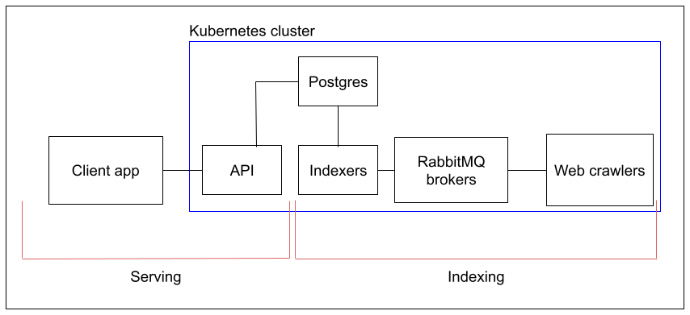

# Architecture Description and Course Report

This document describes the architecture of the search engine and serves as a course report.

## Introduction

We are building a general search engine that indexes pages from the internet. The goal is that our search engine returns reasonable results to websites that contain somewhat relevant information to search terms. Our aim is to study the mechanisms used in simple search tasks and study architectural patterns while building one. We wish to index only a fraction of the internet but make an engine that has the potential to scale to index the entire internet.

The design of the search engine follows the Microservices pattern language, with inherent traits of scalability and modularity. We are heavily utilizing [Docker](https://www.docker.com/) and [Kubernetes](https://kubernetes.io/) to containerize our services and orchestrate the application. This allows us to develop each service independently from each other and use whatever technologies we see fit for each task. Furthermore, it helps us divide development tasks because there are clear boundaries between each service.

The experimentation setup section describes the roles of each service of the search engine in detail and the reasoning behind architectural choices.  
In the end, we will also list observations, conclusions, and lessons learned from this project.

## Experimentation Setup

All of our backend services are in a Kubernetes cluster. The definitions for these services are in [../k8s](../k8s/).  
This makes it easy for us to deploy and manage the application and complexity.

_Architectural Effects:_

++ Increases scalability because Kubernetes can be configured to automatically scale services up/down according to demand.  
++ Increases maintainability because Kubernetes offers lots of tooling to manage services. This is particularly good because some of the standard tooling is very common in the industry.  
-- Increases complexity because Kubernetes is not an easy system to understand fully.

The search engine can be divided into two major parts: Indexing and Serving, which roughly translate to the backend and frontend of the application.



### Indexing

The first major part of our application is Indexing, which refers to services that are needed to form our search index of the internet.  
Indexing contains a few parts: Crawler, RabbitMQ, Indexer, and Database.

#### Crawler

The crawler is an application (or "bot") that scans web pages for relevant terms within the page. For example, the relevant terms for a page about making mocha cake would probably be "mocha", "cake", "cooking", "baking". The crawler uses many heuristics to form these kinds of lists from web pages. After scanning a page for relevant terms, the crawler looks up links to other pages, which it then continues to scan.

The crawler is implemented in [../webcrawler](../webcrawler/), and it uses the [scrapy](https://scrapy.org/) framework.

_Workflow:_

- The crawler connects and authenticates to RabbitMQ
- Then it starts crawling on some predefined web pages
- It finds links in websites and follows them to new websites
- Whenever it encounters a new web page:
  - Check if we can crawl this page (is https, robots.txt rules, language="en")
  - If yes, scan the page for words
  - Preprocess words
    - Transform all words into lowercase
    - Remove words with a single letter, like "i", "a"
    - [Lemmatize](https://en.wikipedia.org/wiki/Lemmatization) words using a lookup from [this dictionary](https://github.com/michmech/lemmatization-lists/blob/master/lemmatization-en.txt)
    - Remove words that do not provide value, like ["and", "then", "is"](https://en.wikipedia.org/wiki/Most_common_words_in_English)
    - Among other things ...
  - Assemble a list of relevant words on this page
  - Send a message to RabbitMQ

The format of the message is as follows:

```json
{
  "url": "example.com",
  "title": "Example Domain",
  "keywords": {
    "word1": {
      "relevance": 70,
      "term_frequency": 0.5
    },
    "word2": {
      "relevance": 60,
      "term_frequency": 0.45
    },
    ...
  }
}
```

#### RabbitMQ

We use [RabbitMQ](https://www.rabbitmq.com/) as a message broker between the Crawlers and Indexers. This allows us to detach the crawlers and indexers from each other architecturally.

_Architectural Effects:_

++ Improves scalability because we can have multiple crawlers and multiple indexers, which do not need to know about each other. This also acts as a load balancer for the indexers since each message should be handled by only one indexer.  
++ Improves fault tolerance because any of the crawlers or indexers can crash at any point, and the system will still function. Also, the nodes in RabbitMQ itself can crash, which might result in some losses in messages, but the system should be able to recover after some time.  
++ Improves extensibility because we can add new types of crawlers and indexers (e.g. image search) by just creating a new topic in RabbitMQ.  
-- The costs of the system increase because we need to have more processes constantly running.  
-- The system has more complexity overall. First, we wanted to use Kafka because it's more performant according to some sources, but it looks a lot more complex than RabbitMQ. We decided to opt for this one to keep the complexity under control for this project.

#### Indexer

The indexer is an application that takes crawl results from Crawlers and processes them into a suitable format (reverse-index) for the database.

The indexer is implemented in [../indexer](../indexer/).

For example, the reverse-index for the `example.com` message would look like this:

```json
{
  "word1": ["example.com"],
  "word2": ["example.com"]
}
```

_Workflow:_

- The indexer connects and authenticates to Postgres
- The indexer connects and authenticates to RabbitMQ
- Whenever a message is received from RabbitMQ
  - Wait 30s or until message buffer size (e.g. 100) is reached
  - Convert the buffer to database compliant reverse-index
  - Flush the converted buffer to the database
  - Send acknowledgment of the whole buffer to RabbitMQ

_Architectural Effects:_

++ Improves search speed due to reverse-index because we don't have to look up every domain if it has the keywords. Now we can instead look up which domains have the keyword.  
++ Reduces load on the database by reducing the number of requests and instead sending a lot of data with each request.  
-- Increases system complexity.

#### Database

We use [Postgres](https://www.postgresql.org/) to store our search index.

The database has 3 tables:

- `websites`
- `keywords`
- `relations`

The database is optimized using [indexes](https://www.postgresql.org/docs/current/indexes.html) to speed up search queries.  
The database schema is found in [../indexer/../db.go](../indexer/internal/db/db.go).

_Architectural Effects:_

-- Reduces scalability because it's a relational database and it doesn't scale horizontally. We could use [CockroachDB](https://www.cockroachlabs.com/) or [Cassandra](https://cassandra.apache.org/_/index.html) to make it distributed. However, these are not familiar technologies for us, and we want to get a functional service up as quickly as possible. Therefore in the current state of this project, the main bottleneck is the database.

#### IDF

We use [TF-IDF](https://en.wikipedia.org/wiki/Tf%E2%80%93idf) along with the relevance of words when scoring the search results. Term frequency (TF) is calculated by the crawler, but Inverse document frequency (IDF) is calculated as a separate cron job due to it requiring more computing power. Preferably IDF calculations would run at night.

The calculations are done in batch sizes of `1,000,000` to reduce the size of one commit.

_Architectural Effects:_

++ Reduces load on the database due to not having to recalculate IDF for each relation every time new data is inserted  
-- Further increases system complexity  
-- Requires a lot of CPU power during calculations

### Serving

The second major part of our application is Serving, which refers to services that are needed to make our search index accessible to people.  
Serving has two parts: an API and a Client.

#### API

The API is supposed to serve as the only public entry point into the application. It handles incoming HTTP requests and queries the database for results. It also might have some data processing if needed.

The API is implemented as a simple REST API, with one GET endpoint: `/search`.  
The endpoint takes the search query in a query parameter `q` with URI normalization applied to it.

For example, when searching for "cat pictures", the query would be like this:

```
/search?q=cat+pictures
```

It queries the Postgres database for search results and returns them as a JSON response like this:

```json
{
  "results": [
    {
      "url": "https://www.catoftheday.com/",
      "title": "Cat of the day",
      "score": 0.456542,
      "keywords": [
        "cat",
        ...
      ]
    },
    { "url": "https://www.reddit.com/r/catpictures/", ...},
    ...
  ],
  "query_time": "0.031s",
  "total_hits": 20,
  ...
}
```

#### Client

The Client is a simple static web application that queries our API for search results and presents them nicely. Before we have formed the index, it is used as a notice (which the crawlers point to) for websites to inform about what the web traffic is about.

The Client is implemented using the [Astro](https://astro.build/) framework, and it is hosted on [GitHub Pages](https://pages.github.com/).

It is available at https://ronituohino.github.io/swap/.

## Observations, Lessons learned and Conclusions

### Infrastructure

Setting up the infrastructure for this kind of project requires some work, but preplanning properly what services handle certain tasks helps a lot. Because of the preplanning, we were able to divide tasks and develop them individually using tools of our choice. The infrastructure we chose ended up being quite performant, and the main bottleneck currently is the non-distributed database.

### Tools

Searching up tools can speed up the development. As an example, first we were going to do our own web crawler implementation which was quite slow in its simplest implementation. We ended up using a library for it. If there is a ready and maintained tool for some task, it should at least be considered instead of always creating our own implementation.

Using tools like Copilot can speed up the development if used correctly. One must understand the changes it suggests before pressing accept. They can also help developers by pushing them in the right direction of solving problems. Although it's not recommended to use such tools if in the early stages of learning to code.

### Data management

Data management ended up being one of the hardest parts of this project. We created our index by scraping the internet for `~4hr` using only **one** web crawler and indexer which resulted in the following:

| Table name | Total count | Total size | Table size | Index size |
| ---------- | ----------- | ---------- | ---------- | ---------- |
| websites   | ~140k       | 44 MB      | 26 MB      | 19 MB      |
| keywords   | ~190k       | 13 MB      | 9.5 MB     | 4.2 MB     |
| relations  | ~17.3m      | 2015 MB    | 1125 MB    | 890 MB     |

Surprisingly, a lot of data fits into the index while maintaining reasonable disk usage.

Our next problem was that queries took a lot of time. The following numbers are when using a free-tier hosting provider with only one CPU available. When searching `Los Angeles` the search took `~8.83s`. We ended up adding database indexes for the relations table which resulted in the same query taking `~2.83s`, and increasing the relations index size by `236MB`.

| Table name | Total count | Total size | Table size | Index size |
| ---------- | ----------- | ---------- | ---------- | ---------- |
| websites   | ~140k       | 44 MB      | 26 MB      | 19 MB      |
| keywords   | ~190k       | 13 MB      | 9.5 MB     | 4.2 MB     |
| relations  | ~17.3m      | 2251 MB    | 1125 MB    | 1126 MB    |

Then the next problem we faced was IDF calculations. The first version we had would've taken an unreasonable amount of time (days) for the above table sizes. To improve this we removed batching to process all in one, and also increased the `shared_buffers`, `work_mem` and `max_wal_size` in PostgreSQL drastically. This resulted in an 8-core CPU processing IDF updates for all `~17.3m` relations in `~18min`. We tried to re-add batches with a size of `100,000` which resulted in `~55min` processing time. We ended our experiments there, transaction management and query optimization course is starting in the next period... Batch processing would offer benefits such as smaller transactions, the system remains responsive, and fewer locks.

### Buffers

Processing data in bulks is usually better if there is a lot of data moving around.

In the first version of the indexer when it received a message from RabbitMQ it instantly inserted the message into the database. When we started 3 indexers, 3 web crawlers, and 3 RabbitMQ instances in parallel we got Postgres constantly throwing errors about deadlocks.

To reduce this we added a message buffer and flush timer. Now it processes `100` messages or waits for `30s` before inserting them into the database in bulk. The messages are acknowledged to RabbitMQ by the indexer after all of them are inserted into the database. Therefore either all of them succeed or all fail.
