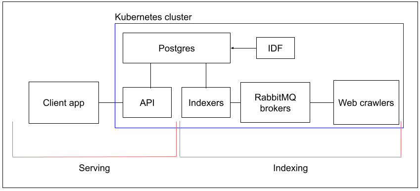

# Architecture Description and Course Report

This document describes the architecture of the search engine, and serves as a course report.

## Introduction

We are building a general search engine, that indexes pages from the internet. The goal is that our search engine returns reasonable results to websites that contain somewhat relevant information to search terms. Our aim is to study the mechanisms used in simple search tasks, and study architectural patterns, while building one. We wish to index only a fraction of the internet, but make an engine that has the potential to scale to index the entire internet.

The design of the search engine follows the Microservices pattern language, with inherent traits of scalability and modularism. We are heavily utilizing [Docker](https://www.docker.com/) and [Kubernetes](https://kubernetes.io/) to containerize our services and orchestrate the application. This allows us to develop each service independently from each other, and use whatever techonologies we see fit for each task. Furthermore, it helps us divide development tasks, because there are clear boundaries between each service.

The experimentation setup -section describes the roles of each service of the search engine in detail, and reasoning behind architectural choices.  
In the end, we will also list observations, conclusions, and lessons learned from this project.

## Experimentation Setup

All of our backend services are in a Kubernetes cluster. The definitions for these services are in [../k8s](../k8s/).  
This makes it easy for us to deploy and manage the application and complexity.  

_Architectural Effects:_

++ Increases scalability, because Kubernetes can be configured to automatically scale services up/down according to demand.  
++ Increases maintainability, because Kubernetes offers lots of tooling to manage services. This is particularily good, because some of the standard tooling is very common in the industry.  
-- Increases complexity, because Kubernetes is not an easy system to understand fully. 

The search engine can be divided into two major parts: Indexing, and Serving, which roughly translate to the backend and frontend of the application.  



### Indexing

The first major part of our application is Indexing, which refers to services that are needed to form our search index of the internet.  
Indexing contains a few parts: Crawler, RabbitMQ, Indexer, and Database.

#### Crawler

The crawler is an application (or "bot") that scans web pages for relevant terms within the page. For example, the relevant terms for a page about making mocha cake would probably be "mocha", "cake", "cooking", "baking". The crawler uses many heuristics to form these kinds of lists from web pages. After scanning a page for relevant terms, the crawler looks up links to other pages, which it then continues to scan.

The crawler is implemented in [../webcrawler](../webcrawler/), and it uses the [scrapy](https://scrapy.org/) framework.  

_Workflow:_

- The crawler connects and authenticates to RabbitMQ
- Then it starts crawling on some predefined webpages
- It finds links in websites, and follow them to new websites
- Whenever it encounters a new web page:
  - Check if we can crawl this page (is https, robots.txt rules, language="en")
  - If yes, scan the page for words
  - Preprocess words
    - Transform all words into lowercase
    - Remove words with a single letter, like "i", "a"
    - [Lemmatize](https://en.wikipedia.org/wiki/Lemmatization) words using a lookup from [this dictionary](https://github.com/michmech/lemmatization-lists/blob/master/lemmatization-en.txt)
    - Remove words that do not provide value, like ["and", "then", "is"](https://en.wikipedia.org/wiki/Most_common_words_in_English)
    - Among other things ...
  - Assemble a list of relevant words in this page
  - Send a message to a RabbitMQ

The format of the message is as follows:

```
{ 
  "url": "example.com",
  "title": "Example Domain",
  "keywords": {
    "domain": {
      "relevance": 70,
      "term_frequency": 0.5
    },
    "example": {
      "relevance": 60,
      "term_frequency": 0.45
    },
    ...
  }
}
```

#### RabbitMQ

We use [RabbitMQ](https://www.rabbitmq.com/) as a message broker between the Crawlers, and Indexers. This allows us to detach the crawlers and indexers from each other architectually. 

_Architectural Effects:_

++ Improves scalability, because we can have multiple crawlers, and multiple indexers, which do not need to know about eachother. This also acts as a load balancer for the indexers, since each message should be handled by only one indexer.  
++ Improves fault-tolerance, because any of the crawlers or indexers can crash at any point, and the system will still function. Also, the nodes in RabbitMQ itself can crash, which might result in some losses in messages, but the system should be able to recover after some time.  
++ Improves extensibility, because we can add new types of crawlers and indexers (e.g. image search) by just creating a new topic in RabbitMQ.  
-- The costs of the system increase, because we need to have more processes constantly running.  
-- The system has more complexity overall. First we wanted to use Kafka, because its more performant according to some sources, but it looks a lot more complex than RabbitMQ. We decided to opt for this one to keep the complexity under control for this project.

#### Indexer

The indexer is an application that takes crawl results from Crawlers, and processes them to suitable format (reverse-index) for the database. In addition, some search-relevance processing could be done at this stage as well, but we are not sure yet.

The indexer is implemented in [../indexer](../indexer/).   

For example, the reverse-index for the `example.com` message would look like this:

```
{ 
  "domain": ["example.com"], 
  "example": ["example.com"] 
}
```

_Workflow:_

- The indexer connects and authenticates to Postgres
- The indexer connects and authenticates to RabbitMQ
- Whenever a message is received from RabbitMQ
  - Add data to local reverse-index
  - Start a timer if not active already (e.g. 60s)
  - If new messages arrive, add them to the local index
  - When the timer expries, flush the local index to the database

_Architectural Effects:_

++ Improves search speed due to reverse-index, because we don't have to look up every domain if it has the keywords. Now we can instead look up which domains have the keyword.  
++ Reduces load on the database by reducing the amount of requests, and instead sending a lot of data with each request.
-- Increases system complexity.

#### Database

We use [Postgres](https://www.postgresql.org/) to store our search index.  

The database would have 3 tables:
- `websites`
- `keywords`
- `relations`

The database should be optimized using [indexes](https://www.postgresql.org/docs/current/indexes.html) to speed up search queries.  
The database schema is found in [../postgres.sql](../postgres.sql).


_Architectural Effects:_
 
-- Reduces scalability, because it's a relational database and it doesn't scale horizontally. We could use [CockroachDB](https://www.cockroachlabs.com/) or [Cassandra](https://cassandra.apache.org/_/index.html) to make it distributed. However, these are not a familiar technologies for us, and we want to get a functional service up as quickly as possible.

### Serving

The second major part of our application is Serving, which refers to services that are needed to make our search index accessible to people.  
Serving has two parts: an API, and a Client.

#### API

The API is supposed to serve as the only public entrypoint into the application. It handles incoming http requests, and queries the database for results. It also might have some data processing if needed. 

The API is implemented as a simple REST API, with one GET endpoint: `/search`.  
The endpoint takes the search query in a query parameter `q` with URI normalization applied to it.

For example, when searching for "cat pictures", the query would be like this:

```
/serch?q=cat+pictures
```

It queries the Postgres database for search results, and returns them as a JSON response like this:

```
{
  "results": [
    { "url": "https://www.catoftheday.com/", ... },
    { "url": "https://www.reddit.com/r/catpictures/", ...},
    ...
  ],
  "query_time": "0.0000001s",
  ...
}

```

#### Client

The Client is a simple static web application, that queries our API for search results, and presents them nicely. Before we have formed the index, it is used as notice (which the crawlers point to) for websites to inform about what the web traffic is about. 

The Client is implemented using the [Astro](https://astro.build/) framework, and it is hosted on [GitHub Pages](https://pages.github.com/).  

It is available at https://ronituohino.github.io/swap/.

## Observations, Conclusions, and Lessons Learned

TODO: in final report

TOOD: add more recommendations to architectural effects